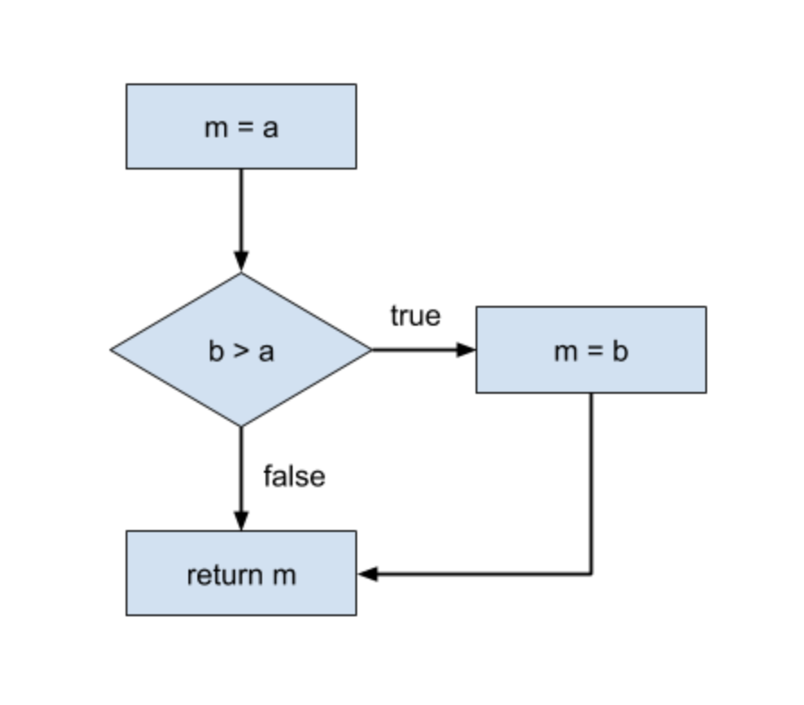

# Cyclomatic Complexity

Cyclomatic complexity is basically a measure of how many "paths" exist through a section of code. This has implications for testing because code with greater cyclomatic complexity (more paths) can be more difficult to test thoroughly. Take, for example, the following code:

```python
def max(a, b):
  m = a
  if b > a:
    m = b
  return m
```

We could convert this to a directed graph easily enough:



There are two unique paths through this graph, so when we test this function we
need to be sure to test both paths. In this case, as long as we do a good job
choosing test values we'll be just fine, but more complicated functions can be
trickier.

One way to reduce this burden is to try to reduce the cyclomatic complexity of
our code. For example, it is generally considered bad practice to have
deeply-nested conditional statements (if-else inside an if-else inside an
if-else, and so on). Another trick some people use to make these paths easier to
think about is the early exit, returning from a function immediately if there is
no work to be done or if the result can be computed trivially. This doesn't
necessarily make our code less complex mathematically speaking, but it makes the
complexity easier to deal with for our puny human brains.

## Further Reading

  * <http://users.csc.calpoly.edu/~jdalbey/206/Lectures/BasisPathTutorial/index.html>
  * <http://juacompe.mrchoke.com/natty/thesis/FrameworkComparison/A%20complexity%20measure.pdf>
  * <https://en.wikipedia.org/wiki/Cyclomatic_complexity>
