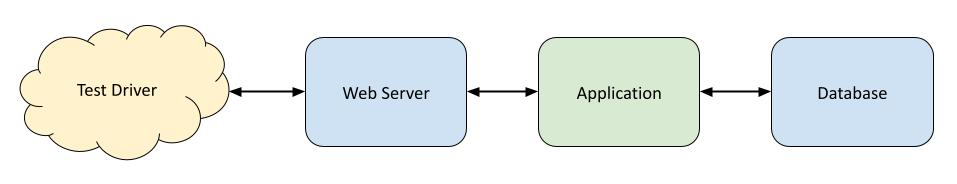

# Integration Testing

  * [Example](example/)
  * [Assignment](assignment/)

At its core, an integration test is one that attempts to verify more than one
part of an overall system together working in tandem. In other words, the
different parts are "integrated" together during testing.

In practice, integration testing often refers to what is called an "end-to-end"
test, and this is what we will focus on.

## End-to-End Testing

An "end-to-end" test verifies that all (or most) of the components of a software
system work correctly together. This kind of testing can be used in two
different situations:

  * integrating a custom component with off-the-shelf components that will exist
    in production, like a database
  * integrating two or more custom components with one another, and optionally
    off-the-shelf components

Let's say that we've written a web app in PHP, a common web scripting language.
It is very common to deploy PHP applications using a separate web server like
Apache or Nginx. The web server receives requests from the network, then runs
the correct PHP code for requests that match rules defined by the developer or
system administrator.

It is also common for web applications in general to rely on a database such as
MySQL. During development, however, developers often choose to use a simpler
database system such as SQLite that allows them to iterate more quickly (make a
change, manually test the change).



An end-to-end test is, at its most basic, an integration that includes an entire
"trip" through the system, from input to output, and whatever comes in between.

The most challenging part of end-to-end testing is often getting all of the
necessary components running at the same time, with the correct versions and
configurations. Thankfully, Docker can help us manage this complexity.

## Docker Compose

We've used Docker previously to encapsulate tools in a way that minimizes the
impact of differences between computers. We can also use Docker for integration
testing. With Docker, developers can easily start different applications and
have them talk to one another just like they will in the production environment.

Even better, since the container images are shared, the application will always
run with the correct version of each of its components, whether it is on a
developer workstation, a test environment, or a continuous integration
environment.

There are a number of ways to do this, including
[Kubernetes](http://kubernetes.io), which has become quite popular for
production deployments. We are going to use a tool called Docker
[Compose](https://docs.docker.com/compose/). We're going to use Compose because
it is simpler than Kubernetes and ships with Docker itself, meaning it is
probably already installed if you have used Docker before.

### Create Images

The first thing we need to do is "Dockerize" each piece of our system. This
means, in practice, our application (which may include more than one service),
and any third-party components like databases.

In general, we just need a `Dockerfile` for each service we intend to run.

### Configure Compose

Compose uses a file called `docker-compose.yml` by default. Take a look at the
one in the `example/` directory. The basic format is outlined below.

```yaml
services:
  <service name>:
    <service configuration...>
```

### Run the Tests

Once Compose has been configured correctly, the entire application can be run.

