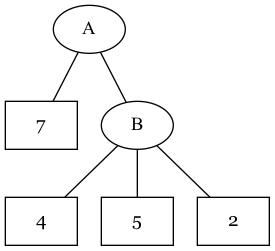

# Linters and Formatters

  * [Homework](assignment/)

Not all static analysis has to do with types. There are many pitfalls and other
undesirable patterns that we can detect in code without actually running it that
have little or nothing to do with a type system.

Tools that help us detect problems, or potential problems, in our code are often
referred to as "linters" (because they find "lint" in our code, get it?). There
are many, many linters in existence, for many different programming languages.
We will take a look at a few examples and then write our own linter.

## Style and Formatting

You might not think that coding style would be a major concern, but it is. There
are a few famous style debates, and hundreds of smaller ones faced by software
development teams every day.

Probably the most famous debate has to do with the placement of curly braces in
C-style languages. There are a number of different, syntactically valid ways to
situation curly braces, and everyone has a favorite.

Some of the possible curly brace styles for conditionals are shown below. Note,
however, that functions are often treated differently, which creates a
combinatorial explosion of possible styles. Which do you prefer?

```c
// K&R
if (...) {

}

// Allman
if (...)
{
    ...
}

// GNU
if (...)
  {
    ...
  }

// Horstmann
if (...)
{   ...
    ...
}

// Whitesmiths
if (...)
    {
    ...
    }
```

Clearly, programmers have always had a lot of free time on their hands. However,
we still need to get work done (eventually). For this reason, it is generally
considered a good idea for a team to decide on code standards for a project
ahead of time and enforce those decisions automatically... with linters and
formatters.

There are other, less controversial, examples. Single-letter variable names are
often considered bad style, as are variable names that do not conform to the
conventions of the language in use (more on this later). It is also widely
viewed as good style to include documentation at the beginning of each class and
function.

All of these choices, and more, can be enforced with linters, which can save a
team a lot of time and energy to put toward building great software.

### Formatters

Like linters, formatters attempt to enforce certain style conventions on code.
However, instead of simply finding incorrect code, they can also rewrite entire
source files to conform to a set of style guidelines.

The typical workflow is for a developer to run the formatter before submitting a
pull request or otherwise merging code. That way, any style issues are corrected
and the developer doesn't have to spend the time to fix them manually.

## Practices

We can also use linters to enforce good programming practices. This can help
prevent bugs before they happen, improve performance, and enforce security
practices.

TODO

## Examples

Below is a collection of well-known linters and formatters for various
languages, along with simple usage examples and recommendations.

### Black (Python)

  * [GitHub](https://github.com/psf/black)
  * [Documentation](https://black.readthedocs.io/en/stable/)

Black is a formatter for Python. It can be configured based on the preferences
of the user and it can automatically modify code so that it is correctly
formatted.

Black has a command line option, `-c` that allows you to pass it small pieces of
source code to be formatted. We can use this for some very simple examples:

```output
$ black -c "a=4"
a = 4

$ black -c "foo( 5 )"
foo(5)
```

Ordinarily, Black is run against a Python file and the file is modified in-place
with the formatted content.

```output
$ black caselinter.py
reformatted caselinter.py
All done! ✨ 🍰 ✨
1 file reformatted.
```

### Clippy (Rust)

  * [GitHub](https://github.com/rust-lang/rust-clippy)
  * [Lints](https://rust-lang.github.io/rust-clippy/stable/index.html)

TODO

### HLint (Haskell)

  * [GitHub](https://github.com/ndmitchell/hlint)

TODO

### Pylint (Python)

  * [GitHub](https://github.com/PyCQA/pylint)
  * [Documentation](https://pylint.pycqa.org/en/latest/)

TODO

### Rustfmt

  * [GitHub](https://github.com/rust-lang/rustfmt)
  * [Documentation](https://rust-lang.github.io/rustfmt/)

## A Linter From Scratch

We're going to write a linter from scratch to see how they work and get some
practice working with the concepts central to static analyzers in general. Our
linter isn't going to do much, it will run on a Python file and identify any
classes that do not have `CamelCase` names and functions that do not have
`snake_case` names.

### Define Cases

First, we need to decide how to tell if a name is cased correctly. We could
probably come up with all kinds of clever heuristics, but we will keep it simple
and say that any name that starts with a capital letter and does not contain any
underscores (`_`) is in proper camel case. We will assume that any name that
consists only of lowercase letters and underscores is in proper snake case.

We can codify these definitions with code. We will use the following function
to determine whether a name is in camel case:

```python
def _is_camel(value: str) -> bool:
    if "_" in value:
        return False
    if value[0].upper() != value[0]:
        return False
    
    return True
```

The following function will tell us if a name is in snake case:

```python
def _is_snake(value: str) -> bool:
    if value.lower() != value:
        return False
    
    return True
```

### Visitor Pattern

Before we go further, we need to take a little detour.


The [visitor pattern](https://en.wikipedia.org/wiki/Visitor_pattern) is a way to
add additional functionality to a group of related classes. It is often used to
process trees and other nested data structures.  Since, as the name suggests,
the Abstract Syntax Tree (AST) produced by a parser for a programming language
is such a data structure, we can use a visitor to process the AST and identify
mis-named classes and functions.

First, we will take a look at a simple visitor example using a tree that
consists of two kinds of vertices. We will refer to an interior vertex (that is,
on that has children) as a "node", and a leaf vertex (one without children) as a
"leaf".

A simple tree, where each leaf stores a
single integer, might look like the one in the diagram below.



We can define some classes to represent this tree. A `Node` represents an
interior node in the tree and a `Leaf` represents a leaf. The leaf node can
store data (as in the diagram above).

```python
class Node:
    def __init__(self, name, *children):
        self.name = name
        self.children = children

class Leaf:
    def __init__(self, data):
        self.data = data
```

We can construct the tree in the diagram above like this:

```python
tree = Node("A",
    Leaf(7),
    Node("B",
        Leaf(4),
        Leaf(5),
        Leaf(2),
    ),
)
```

Let's sum the values stored in the leaf nodes. This is simple to do using a
graph traversal, but we can also use a visitor to get the same effect.  We will
implement a standard traversal, followed by a visitor for comparison.

```python
def sum_leaves(tree):
    if type(tree) is Node:
        total = 0
        for child in tree.children:
            total += sum_leaves(child)
        return total
    if type(tree) is Leaf:
        return tree.data
```

There is nothing wrong with the code above, but if we had many different kinds
of vertices it might get tedious to implement several operations this way. One
way to simplify things is to use a visitor.

First, we define a base class that abstracts out the traversal behavior. When a
node is visited, the visitor proceeds to visit all of its children. When a leaf
is visited, the visitor does nothing (since there isn't anything obvious to do).
This breakdown of the tree by types lies at the heart of the visitor pattern. It
allows us to focus on the class instances (vertices, in this case) that interest
us, and ignore the ones that don't. A visitor base class like this would
generally be provided by the library that provides the classes it is used with.

```python
class Visitor:
    def visit(tree):
        if type(tree) is Node:
            self.visit_node(tree)
        if type(tree) is Leaf:
            self.visit_leaf(tree)

    def visit_node(node):
        for child in node.children:
            self.visit(child)
    
    def visit_leaf(leaf):
        pass
```

We can now implement our summation algorithm as a "summing" visitor. Since this
visitor extends the base class, it can ignore the nodes entirely and focus on
the leaves, since they store the values to be summed.

```python
class SummingVisitor(Visitor):
    def __init__(self):
        self.total = 0
    
    def visit_leaf(leaf):
        self.total += leaf.data
```

We can now use our class like so, reading the sum from the `total` field after
it has finished:

```python
visitor = SummingVisitor()
visitor.visit(tree)
print(visitor.total)
```

The Visitor Pattern is widely used for processing and manipulating ASTs. The
Python `ast` module is no exception, as we will see.

### Case Visitor

Now that we understand the Visitor Pattern, we can make use of the Python `ast`
module to create the rest of our linter. The actual visitor implementation is
shown below.  Visitor methods are implemented using runtime reflection, the base
class looks for a method called `visit_X` where `X` is the class name of the
node to be processed. If such a method is not found, a generic method, on the
base class, is run instead.

```python
import ast

class CaseVisitor(ast.NodeVisitor):
    def __init__(self):
        self.errors = []

    def visit_ClassDef(self, node: ast.ClassDef):
        if not _is_camel(node.name):
            self.errors.append(f"class {node.name} should be CamelCase")
        return super().generic_visit(node)

    def visit_FunctionDef(self, node: ast.FunctionDef):
        if not _is_snake(node.name):
            self.errors.append(f"function {node.name} should be snake_case")
        return super().generic_visit(node)
```

We need to "visit" two kinds of AST node: class definitions and function /
method definitions. In both cases, we simply check to see whether the name
follows the rules we established earlier and encoded in the `_is_camel` and
`_is_snake` functions, and add an error if not.

### Application

We use the visitor class we defined above in a function called `check_file`.
This function accepts a Python source code file, parses it, and applies the
visitor. It returns the error messages collected by the visitor.

```python
def check_file(src: TextIO) -> Iterable[str]:
    code = src.read()
    tree = ast.parse(code)

    case_visitor = CaseVisitor()
    case_visitor.visit(tree)

    return case_visitor.errors
```

The rest of the application just opens the file passed on the command line, and
calls the `check_file` function. It prints the error messages, if there are any,
and sets the exit code accordingly.

```python
if __name__ == "__main__":
    import sys

    path = sys.argv[1]
    with open(path, "r") as file:
        errors = check_file(file)
    
    exit_code = 0
    for error in errors:
        exit_code = 1
        print(f"{path}: {error}")
    
    sys.exit(exit_code)
```

See [caselinter.py](caselinter.py) for the full source code in one place.

### Running

We can run out linter against its own code quite easily.

```sh
python3 caselinter.py
```

Of course, because the AST visitor used some strange method names, we get
errors!

```output
caselinter.py: function visit_ClassDef should be snake_case
caselinter.py: function visit_FunctionDef should be snake_case
```

Since we can't "fix" these method names (they are relied upon by the `ast`
module) we could add a way to ignore those names. This is quite common. One
option would be to look for a special comment like `# caselinter: ignore` and
skip the following line. This is left as an exercise for the reader.

## Conclusion

Linters help us enforce standards on our code. This can result in more
harmonious teams but, more importantly, it helps us produce readable,
maintainable code. Given that human error is the cause of virtually all software
bugs, making our code easier to read and maintain is a worthwhile goal.

Harold Abelson, one of the authors of the famous programming text *Structure and
Interpretation of Computer Programs*, which is sort of the OG software
engineering book, said it best:

  > Programs must be written for people to read, and only incidentally for
  > machines to execute.

## Further Reading

  * rust-code-analysis: a Rust library to analyze and extract maintainability
    information from source code -
    [DOI](https://doi.org/10.1016/j.softx.2020.100635)
  * Tree Sitter: a multi-language parsing library -
    [Web](https://tree-sitter.github.io/tree-sitter/)
