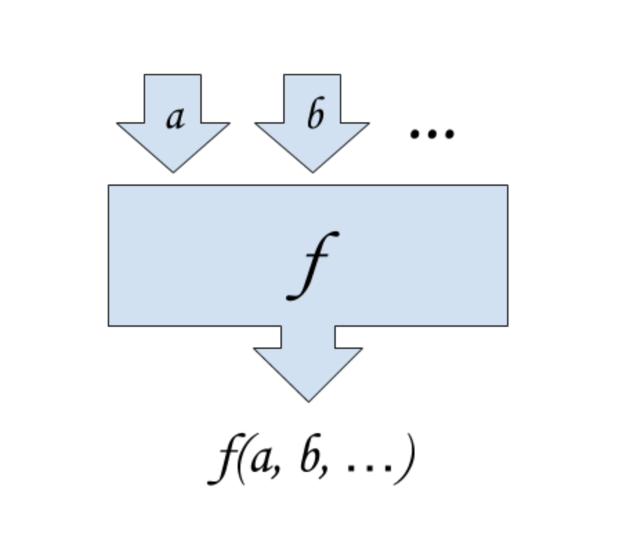

# Pure Functions

We've probably all heard that functions are black boxes that take inputs and
produce outputs. And you've probably seen a diagram like the one below before.
But what does it mean for a function to be "pure" and how do pure functions help
us test our code?



A pure function is one that takes inputs and produces outputs, as illustrated
above and, furthermore, has no "side effects" and no dependencies on any state
outside of the function inputs. A side effect is any modification of the "world"
outside the function itself. For example, the function below prints to the
screen, which is a side effect:

```python
def add(a, b):
  c = a + b
  print(c)
  return c
```

So even though this function also returns a value, it is not a "pure" function.
Another example of a side effect is modifying external state, such as the state
of a class instance:

```python
class Greeter:
  def __init__(self):
    self.greeting = 'hello'

  def setGreeting(self, greeting):
    self.greeting = greeting
```

In this case, the setGreeting function doesn't even return a value, it just
modifies state outside of the function itself.

There's nothing wrong with impure functions, in fact without them we'd never be
able to see the results of our computations. But they tend to be more difficult
to test than pure functions. The reason for this is that we have to check more
places to find out whether the function did what it was supposed to do. In the
first example above, we can easily assert that the value returned from the
function is the sum of its two arguments, but how would we verify that it
printed that sum to the console?

In the second example above, once we've called the setGreeting function we have
to check the greeting attribute on the class to find out if it worked or not. If
setGreeting added to the string, or transformed it in some other way, we'd also
need to make sure that we started out with the correct value in the greeting
attribute before running the test. Consider the following class:

```python
class Adder:
  def __init__(self):
    self.sum = 0

  def add(self, value):
    self.sum = self.sum + value
```

Note that the add method is dependent on the current state of the sum attribute.
If we change sum before we call add we will get a different result for a given
argument (such as 5). In order to test this reliably we need to be careful not
to allow the sum attribute to be modified before we get our hands on it, or we
need to remember to reset it to our preferred start value. If we used a pure
function instead our test would be much simpler to think about, and probably a
bit simpler to write as well:

```python
def adder(sum, addend):
  return sum + addend
```

These are pretty silly examples, but they do illustrate the differences between
pure and impure functions.

## Further Reading

  *
  <https://interactivepython.org/courselib/static/thinkcspy/Lists/PureFunctions.html>
  * <https://en.wikipedia.org/wiki/Pure_function>

